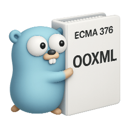

# go-ooxml



This is another of my "things that should exist" projects: a Go library for reading and writing Office Open XML (OOXML) documents. It handles Word (.docx), Excel (.xlsx) and PowerPoint (.pptx) files, with additive retained-source editors for a bounded set of changes. I am developing it against ECMA-376; [the native editing notes](docs/design/native-enhancements.md) spell out what those editors can safely change.

## Installation

```bash
go get github.com/rcarmo/go-ooxml
```

## Usage

```go
package main

import (
	"log"

	"github.com/rcarmo/go-ooxml/pkg/document"
	"github.com/rcarmo/go-ooxml/pkg/presentation"
	"github.com/rcarmo/go-ooxml/pkg/spreadsheet"
)

func main() {
	// Word
	doc, err := document.New()
	if err != nil {
		log.Fatal(err)
	}
	defer doc.Close()
	doc.AddParagraph().SetText("Hello, World")
	if err := doc.SaveAs("hello.docx"); err != nil {
		log.Fatal(err)
	}

	// Excel
	wb, err := spreadsheet.New()
	if err != nil {
		log.Fatal(err)
	}
	defer wb.Close()
	sheet, err := wb.Sheet(0)
	if err != nil {
		log.Fatal(err)
	}
	if err := sheet.Cell("A1").SetValue("Hello"); err != nil {
		log.Fatal(err)
	}
	if err := wb.SaveAs("hello.xlsx"); err != nil {
		log.Fatal(err)
	}

	// PowerPoint
	pres, err := presentation.New()
	if err != nil {
		log.Fatal(err)
	}
	defer pres.Close()
	slide := pres.AddSlide(0)
	if err := slide.AddTextBox(0, 0, 4000000, 1000000).SetText("Hello"); err != nil {
		log.Fatal(err)
	}
	if err := pres.SaveAs("hello.pptx"); err != nil {
		log.Fatal(err)
	}
}
```

## Editing scope

The `document`, `spreadsheet` and `presentation` packages provide the authoring APIs above. Their retained-source editing sessions check the parts they change and refuse unsupported or ambiguous edits. DOCX ordinary text replacement, PPTX plain-shape and existing notes text, and XLSX style-checked numeric edits are implemented subsets. Formula calculation, general worksheet surgery, slide import and complete revision handling are outside those subsets. See [native editing](docs/design/native-enhancements.md) for the precise limits and [testing](docs/testing.md) for measured results. Office rendering and calculation have not been verified by these tests.

## Development

The runtime uses the Go standard library; Godog and Gherkin live in the separate `acceptance/` test module. `pkg/` holds the public APIs, `internal/` holds implementation and fixture lookup helpers, and `e2e/` holds cross-package tests. The pinned `references/fixtures-ooxml/` submodule supplies shared fixture IDs, facts and workflows. Tests leave its files alone and write generated output under local `artifacts/` or temporary directories. The repository also retains older local `testdata/` fixtures and ECMA PDFs for provenance; tests resolve their inputs through the shared manifest.

```bash
git submodule update --init --recursive
GOMAXPROCS=2 make test-batch TEST_JOBS=2
```

`make test` checks only the root module. `test-batch` runs the root and acceptance modules; [docs/testing.md](docs/testing.md) records the pin, integrity checks and latest batch. Use `make help` for other targets.

## License

MIT
